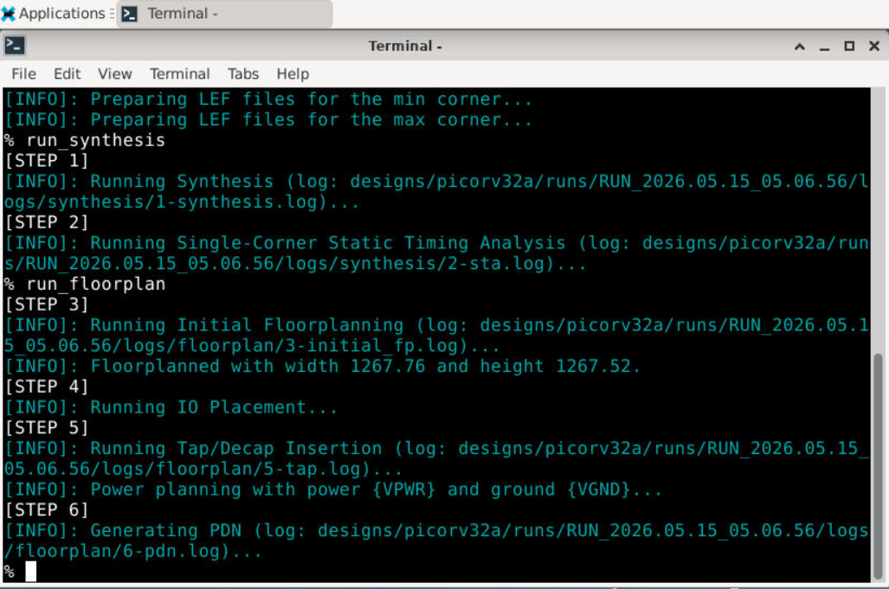
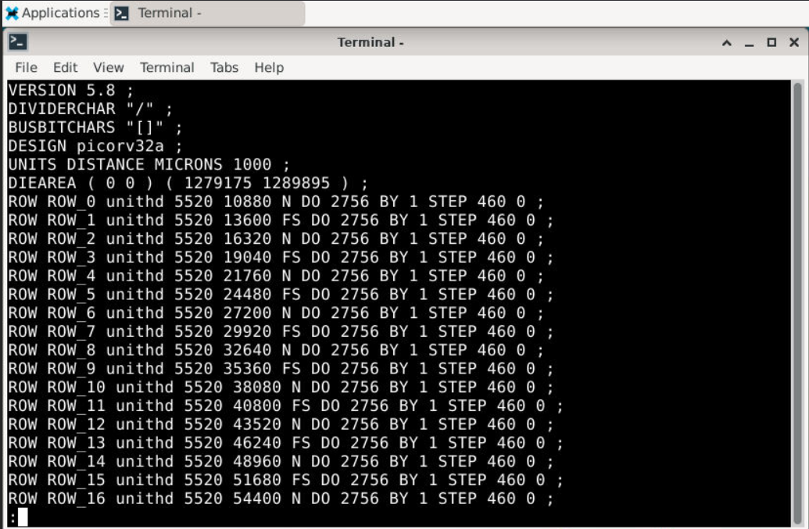
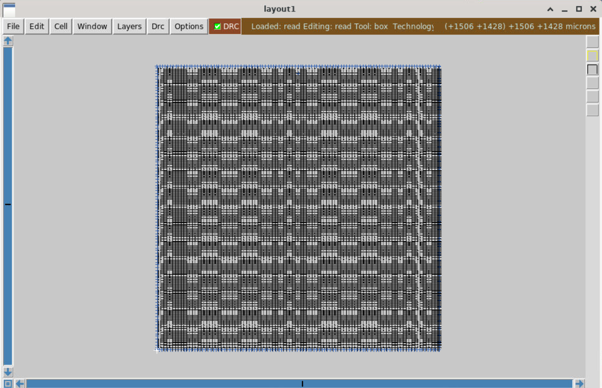
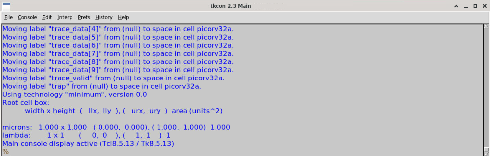
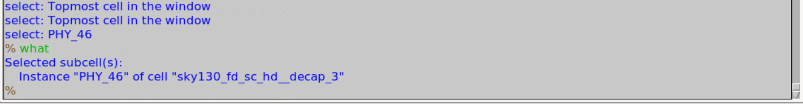
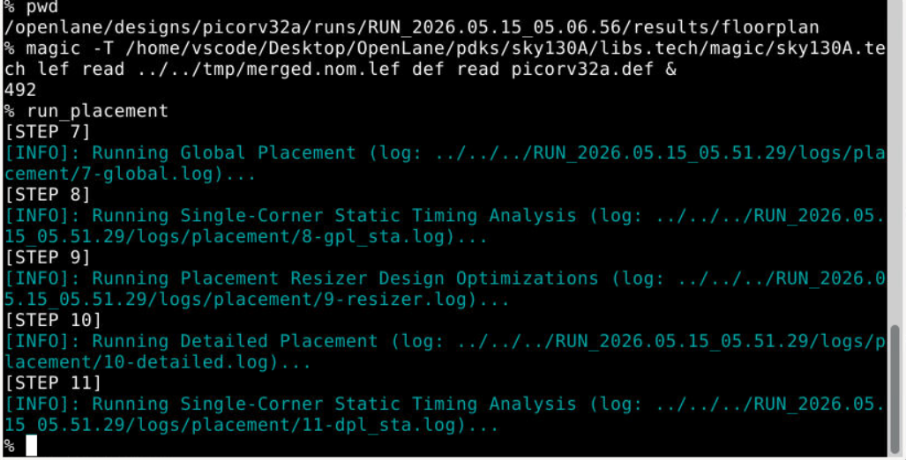
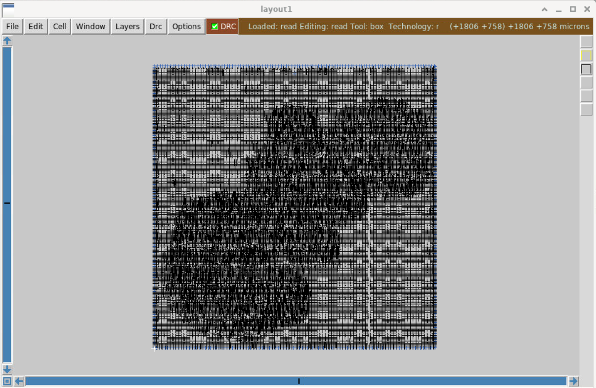

# RTL-to-GDSII-OpenLane-VSD 

## Digital VLSI SoC Design and Planning - RTL to GDSII

A hands-on workshop on complete RTL-to-GDSII flow for digital VLSI SoC design using OpenLane and Sky130 PDK, organized by VSD (VLSI System Design) in collaboration with NASSCOM.

This repository documents my learning, lab progress, implementation results, layout visualizations and key observations from each day of the VSD SoC Design and Planning Workshop.

---

# Day 1 — Inception of Open-source EDA, OpenLANE and Sky130 PDK

The first day of the workshop introduced the complete open-source RTL-to-GDSII ASIC design methodology using OpenLane and the Sky130 Process Design Kit (PDK).  
The focus was mainly on understanding the ASIC physical design flow, setting up the OpenLane environment and performing RTL synthesis on the `picorv32a` RISC-V core.

---

## Day 1 Workflow Overview

| Stage | Description |
|---|---|
| OpenLane Setup | Launching OpenLane inside Docker environment |
| Interactive Mode | Starting Tcl-based OpenLane shell |
| Design Preparation | Loading and configuring `picorv32a` |
| RTL Synthesis | Converting RTL into gate-level netlist |
| Report Analysis | Analyzing synthesis statistics and cell usage |

---

## Launching OpenLane Environment

The OpenLane environment was initialized by entering the OpenLane directory and launching the Docker container in interactive mode.

### Commands Used

```bash
cd /home/vscode/Desktop/OpenLane
make mount
./flow.tcl -interactive
```

The following screenshot shows the successful launch of the OpenLane interactive environment.


---

## Preparing the picorv32a Design

The `prep` command initializes the required environment variables, configuration files, libraries and run directories needed for executing the OpenLane flow.

### Command Used

```tcl
prep -design picorv32a
```

### Important Information Generated During Preparation

| Parameter | Value |
|---|---|
| Process Design Kit | sky130A |
| Standard Cell Library | sky130_fd_sc_hd |
| Optimization Library | sky130_fd_sc_hd |
| Design Name | picorv32a |

The OpenLane environment also creates a dedicated run directory for storing reports, logs, temporary files and generated outputs.


---

## RTL Synthesis using OpenLane

RTL synthesis converts the Verilog RTL description into a gate-level netlist using standard cells from the Sky130 standard-cell library.

### Command Used

```tcl
run_synthesis
```

During synthesis, OpenLane performs:
- Logic synthesis
- Technology mapping
- Timing optimization
- Static Timing Analysis (STA)

The synthesis logs also indicate different synthesis stages being executed internally.


---

## Exploring Generated Synthesis Reports

After synthesis completion, OpenLane automatically generates multiple synthesis reports containing timing, area and cell utilization statistics.

### Commands Used

```bash
cd designs/picorv32a/runs/RUN_<timestamp>/reports/synthesis
ls
```

### Generated Report Files

| Report File | Purpose |
|---|---|
| `1-synthesis.AREA_0.stat.rpt` | Area and cell utilization statistics |
| `1-synthesis_pre.stat` | Pre-synthesis statistics |
| `1-synthesis_dff.stat` | Flip-flop statistics |
| `1-synthesis_pre_synth.chk.rpt` | Pre-synthesis checks |


---

## Synthesis Statistics and Cell Utilization

The generated synthesis report provides detailed information regarding:
- Number of wires
- Number of cells
- Standard-cell usage
- Flip-flop count
- Logic gate distribution

### Important Synthesis Statistics

| Parameter | Value |
|---|---|
| Total Cells | 15762 |
| Total Wires | 15482 |
| Public Wires | 1475 |
| Memory Bits | 0 |
| D Flip-Flops (`dfxtp_2`) | 1613 |

The report also shows the usage count of different standard cells such as:
- Buffers
- NAND gates
- Multiplexers
- Inverters
- Flip-flops

This helps in understanding how the RTL design is physically mapped into technology-specific standard cells.


---

## Key Takeaways from Day 1

- Understood the complete RTL-to-GDSII ASIC design flow.
- Learned how OpenLane operates inside a Docker-based environment.
- Explored the Sky130 open-source Process Design Kit.
- Successfully synthesized the `picorv32a` RISC-V core.
- Analyzed synthesis reports and standard-cell statistics.
- Understood how RTL designs are transformed into gate-level netlists.

---

# Day 2 — Good Floorplan vs Bad Floorplan and Introduction to Library Cells

## Overview

Day 2 focused on understanding the physical planning stage of the ASIC design flow using OpenLANE and Magic VLSI.  
The session explored how the synthesized netlist is converted into a physically organized layout through floorplanning and placement stages.

Major topics covered during the lab:

- Chip floorplanning
- Power Distribution Network (PDN)
- DEF file generation and analysis
- Layout visualization using Magic
- Cell placement and utilization
- Standard cell organization inside the core area

---

## Running Floorplan Stage

After successful synthesis of the `picorv32a` design, the floorplanning stage was initiated inside the OpenLANE interactive environment.

```tcl
run_floorplan
```

The floorplanning stage performs several important physical design operations:

- Defines die and core dimensions
- Generates standard cell rows
- Performs IO placement
- Inserts tap and decap cells
- Builds initial Power Distribution Network (PDN)

The OpenLANE terminal logs during floorplanning are shown below.



---

## Inspecting Generated DEF File

Once floorplanning completed successfully, the generated DEF (Design Exchange Format) file was inspected.

```bash
less picorv32a.def
```

The DEF file contains important physical design information such as:

- Die area dimensions
- Placement rows
- Cell coordinates
- Routing tracks
- Floorplan structure

A portion of the generated DEF file is shown below.



---

## Visualizing Floorplan using Magic VLSI

The generated floorplan DEF was loaded into Magic VLSI for physical layout visualization.

```bash
magic -T /home/vscode/Desktop/OpenLane/pdks/sky130A/libs.tech/magic/sky130A.tech \
lef read ../../tmp/merged.nom.lef \
def read picorv32a.def &
```

This allowed visualization of:

- Standard cell rows
- Power rails
- Core boundaries
- Placement regions

The initial floorplan layout observed in Magic is shown below.



---



---

## Exploring Standard Cells inside Layout

Magic VLSI was further used to inspect specific standard cells present inside the floorplan.

Using the `what` command in Magic helped identify the selected physical cell instance and corresponding Sky130 library cell.

This provided practical understanding of:

- Physical implementation of standard cells
- Decap cell insertion
- Cell naming conventions in Sky130 libraries

The selected cell inspection result is shown below.



---

## Running Placement Stage

After floorplanning, the placement stage was executed.

```tcl
run_placement
```

Placement physically arranges synthesized standard cells inside the predefined floorplan area while considering:

- Timing optimization
- Congestion reduction
- Utilization constraints
- Routing feasibility

The OpenLANE placement execution logs are shown below.



---

## Placement Visualization using Magic

The updated DEF generated after placement was again loaded into Magic for visualization.

Compared to the initial floorplan, the layout now showed:

- Dense standard cell distribution
- Organized logic regions
- Physical implementation of synthesized logic

The placed layout observed in Magic is shown below.



---

## Observations from Floorplan and Placement

During visualization, several important physical design observations were made:

- Floorplanning primarily defines the physical structure of the chip.
- Placement introduces actual logic cell distribution inside the core area.
- Cell density increases significantly after placement.
- Proper floorplanning directly impacts routing and timing quality.
- Decap and tap cells are inserted to improve reliability and power integrity.

---

## Key Learnings from Day 2

- Understood the importance of floorplanning in ASIC implementation
- Learned how DEF files describe physical design information
- Visualized physical layouts using Magic VLSI
- Explored placement and standard cell organization
- Learned the role of tap cells and decap cells
- Observed how synthesized logic is physically arranged after placement
- Gained hands-on exposure to OpenLANE physical design stages

