# RTL-to-GDSII-OpenLane-VSD 

## Digital VLSI SoC Design and Planning - RTL to GDSII

A hands-on workshop on complete RTL-to-GDSII flow for digital VLSI SoC design using OpenLane and Sky130 PDK, organized by VSD (VLSI System Design) in collaboration with NASSCOM.

This repository documents my learning, lab progress, implementation results, layout visualizations and key observations from each day of the VSD SoC Design and Planning Workshop.

---

# Day 1 — Inception of Open-source EDA, OpenLANE and Sky130 PDK

The first day of the workshop introduced the complete open-source RTL-to-GDSII ASIC design methodology using OpenLane and the Sky130 Process Design Kit (PDK).  
The focus was mainly on understanding the ASIC physical design flow, setting up the OpenLane environment and performing RTL synthesis on the `picorv32a` RISC-V core.

---

## Day 1 Workflow Overview

| Stage | Description |
|---|---|
| OpenLane Setup | Launching OpenLane inside Docker environment |
| Interactive Mode | Starting Tcl-based OpenLane shell |
| Design Preparation | Loading and configuring `picorv32a` |
| RTL Synthesis | Converting RTL into gate-level netlist |
| Report Analysis | Analyzing synthesis statistics and cell usage |

---

## Launching OpenLane Environment

The OpenLane environment was initialized by entering the OpenLane directory and launching the Docker container in interactive mode.

### Commands Used

```bash
cd /home/vscode/Desktop/OpenLane
make mount
./flow.tcl -interactive
```

The following screenshot shows the successful launch of the OpenLane interactive environment.


---

## Preparing the picorv32a Design

The `prep` command initializes the required environment variables, configuration files, libraries and run directories needed for executing the OpenLane flow.

### Command Used

```tcl
prep -design picorv32a
```

### Important Information Generated During Preparation

| Parameter | Value |
|---|---|
| Process Design Kit | sky130A |
| Standard Cell Library | sky130_fd_sc_hd |
| Optimization Library | sky130_fd_sc_hd |
| Design Name | picorv32a |

The OpenLane environment also creates a dedicated run directory for storing reports, logs, temporary files and generated outputs.


---

## RTL Synthesis using OpenLane

RTL synthesis converts the Verilog RTL description into a gate-level netlist using standard cells from the Sky130 standard-cell library.

### Command Used

```tcl
run_synthesis
```

During synthesis, OpenLane performs:
- Logic synthesis
- Technology mapping
- Timing optimization
- Static Timing Analysis (STA)

The synthesis logs also indicate different synthesis stages being executed internally.


---

## Exploring Generated Synthesis Reports

After synthesis completion, OpenLane automatically generates multiple synthesis reports containing timing, area and cell utilization statistics.

### Commands Used

```bash
cd designs/picorv32a/runs/RUN_<timestamp>/reports/synthesis
ls
```

### Generated Report Files

| Report File | Purpose |
|---|---|
| `1-synthesis.AREA_0.stat.rpt` | Area and cell utilization statistics |
| `1-synthesis_pre.stat` | Pre-synthesis statistics |
| `1-synthesis_dff.stat` | Flip-flop statistics |
| `1-synthesis_pre_synth.chk.rpt` | Pre-synthesis checks |

---

## Synthesis Statistics and Cell Utilization

The generated synthesis report provides detailed information regarding:
- Number of wires
- Number of cells
- Standard-cell usage
- Flip-flop count
- Logic gate distribution

## Flip-Flop Ratio Calculation

After synthesis, the flop ratio was calculated using the synthesis statistics report.


```text
Flop Ratio = (Number of D Flip-Flops / Total Number of Cells)

           = 1613 / 15762
           ≈ 0.1023  →  ~10.23%
```

This shows that nearly **10.23%** of the synthesized cells are flip-flops.


This helps in understanding how the RTL design is physically mapped into technology-specific standard cells.

---

## Key Takeaways from Day 1

- Understood the complete RTL-to-GDSII ASIC design flow.
- Learned how OpenLane operates inside a Docker-based environment.
- Explored the Sky130 open-source Process Design Kit.
- Successfully synthesized the `picorv32a` RISC-V core.
- Analyzed synthesis reports and standard-cell statistics.
- Understood how RTL designs are transformed into gate-level netlists.

---

# Day 2 — Good Floorplan vs Bad Floorplan and Introduction to Library Cells

## Overview

Day 2 focused on understanding the physical planning stage of the ASIC design flow using OpenLANE and Magic VLSI.  
The session explored how the synthesized netlist is converted into a physically organized layout through floorplanning and placement stages.

Major topics covered during the lab:

- Chip floorplanning
- Power Distribution Network (PDN)
- DEF file generation and analysis
- Layout visualization using Magic
- Cell placement and utilization
- Standard cell organization inside the core area

---

## Running Floorplan Stage

After successful synthesis of the `picorv32a` design, the floorplanning stage was initiated inside the OpenLANE interactive environment.

```tcl
run_floorplan
```

The floorplanning stage performs several important physical design operations:

- Defines die and core dimensions
- Generates standard cell rows
- Performs IO placement
- Inserts tap and decap cells
- Builds initial Power Distribution Network (PDN)

The OpenLANE terminal logs during floorplanning are shown below.


---

## Inspecting Generated DEF File

Once floorplanning completed successfully, the generated DEF (Design Exchange Format) file was inspected.

```bash
less picorv32a.def
```

A portion of the generated DEF file is shown below.


---

## Visualizing Floorplan using Magic VLSI

The generated floorplan DEF was loaded into Magic VLSI for physical layout visualization.

```bash
magic -T /home/vscode/Desktop/OpenLane/pdks/sky130A/libs.tech/magic/sky130A.tech \
lef read ../../tmp/merged.nom.lef \
def read picorv32a.def &
```

This allowed visualization of:

- Standard cell rows
- Power rails
- Core boundaries
- Placement regions

The initial floorplan layout observed in Magic is shown below.


---


---

## Exploring Standard Cells inside Layout

Magic VLSI was further used to inspect specific standard cells present inside the floorplan.

Using the `what` command in Magic helped identify the selected physical cell instance and corresponding Sky130 library cell.

The selected cell inspection result is shown below.


---

## Running Placement Stage

After floorplanning, the placement stage was executed.

```tcl
run_placement
```

The OpenLANE placement execution logs are shown below.


---

## Placement Visualization using Magic

The updated DEF generated after placement was again loaded into Magic for visualization.

Compared to the initial floorplan, the layout now showed:

- Dense standard cell distribution
- Organized logic regions
- Physical implementation of synthesized logic

The placed layout observed in Magic is shown below.


---

## Key Learnings from Day 2

- Understood the importance of floorplanning in ASIC implementation
- Learned how DEF files describe physical design information
- Visualized physical layouts using Magic VLSI
- Explored placement and standard cell organization
- Learned the role of tap cells and decap cells
- Observed how synthesized logic is physically arranged after placement
- Gained hands-on exposure to OpenLANE physical design stages

---

# Day 3 — Design Library Cell using Magic Layout and ngspice Characterization

## Overview

Day 3 focused on custom standard cell design and characterization using Magic VLSI and ngspice simulation.  
The session explored the complete flow of CMOS inverter design starting from layout visualization and DRC verification to SPICE extraction and transient simulation using the Sky130 PDK.

Major topics covered during the lab:

- CMOS inverter layout analysis
- DRC verification using Magic
- SPICE extraction from layout
- ngspice transient simulation
- Inverter switching characteristics
- Post-layout parasitic understanding
- Standard cell characterization basics

---

## Cloning the Custom Inverter Design Repository

The custom inverter design repository was cloned inside the OpenLane working environment.

```bash
cd ~/Desktop/OpenLane
git clone https://github.com/nickson-jose/vsdstdcelldesign.git
```

The repository contents were verified after cloning.

```bash
cd vsdstdcelldesign
ls
```

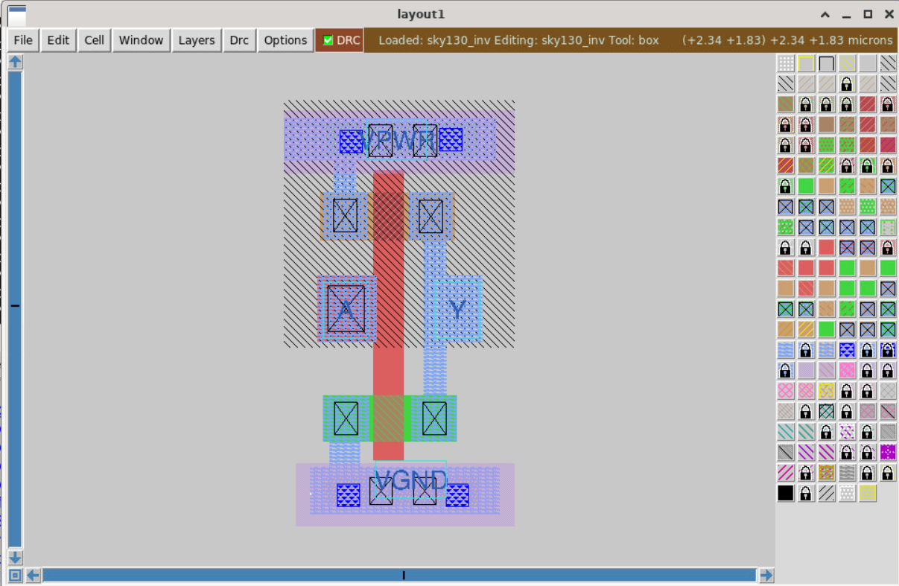

---

## Opening the CMOS Inverter Layout in Magic

The inverter layout file `sky130_inv.mag` was opened using Magic VLSI along with the Sky130 technology file.

```bash
magic -T /home/vscode/.ciel/ciel/sky130/versions/*/sky130A/libs.tech/magic/sky130A.tech sky130_inv.mag &
```

The inverter layout was successfully loaded inside Magic.

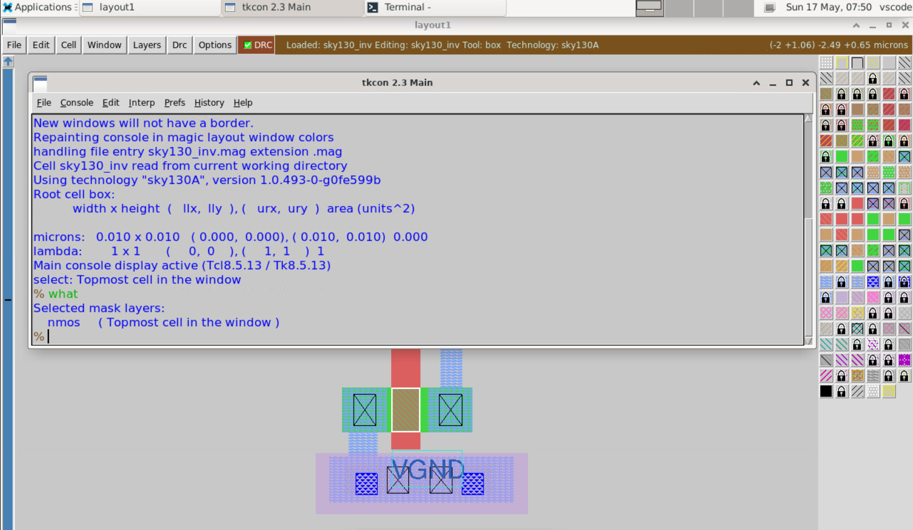

---

## Exploring the CMOS Inverter Layout

The layout consists of:

- PMOS transistor in the upper region
- NMOS transistor in the lower region
- Poly routing
- Metal interconnections
- Power and ground rails
- Input and output connections

Different layers and device structures were explored using Magic.

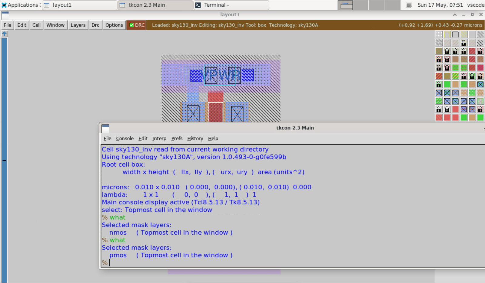

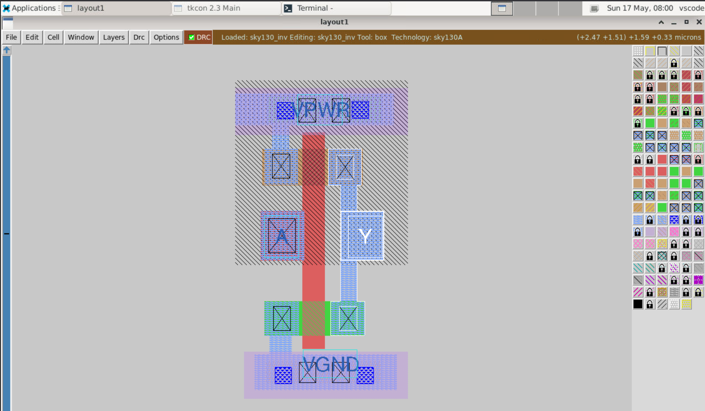

---

## Performing DRC Verification

Design Rule Checks (DRC) were performed to verify whether the layout followed Sky130 fabrication rules.

```tcl
:drc check
:drc why
```

The layout was verified for proper spacing, enclosure and connectivity rules.

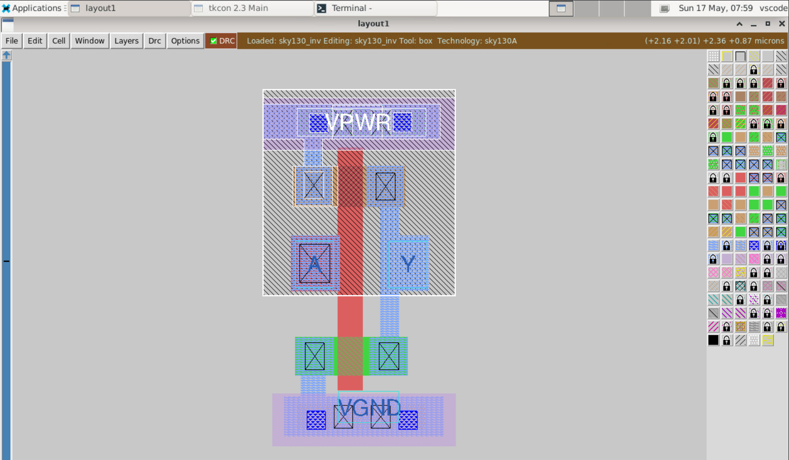

---

## Extracting SPICE Netlist from Layout

The layout was extracted to generate a SPICE netlist for circuit simulation.

```tcl
extract all
ext2spice cthresh 0 rthresh 0
ext2spice
```

This generated the extracted SPICE file:

```bash
sky130_inv.spice
```

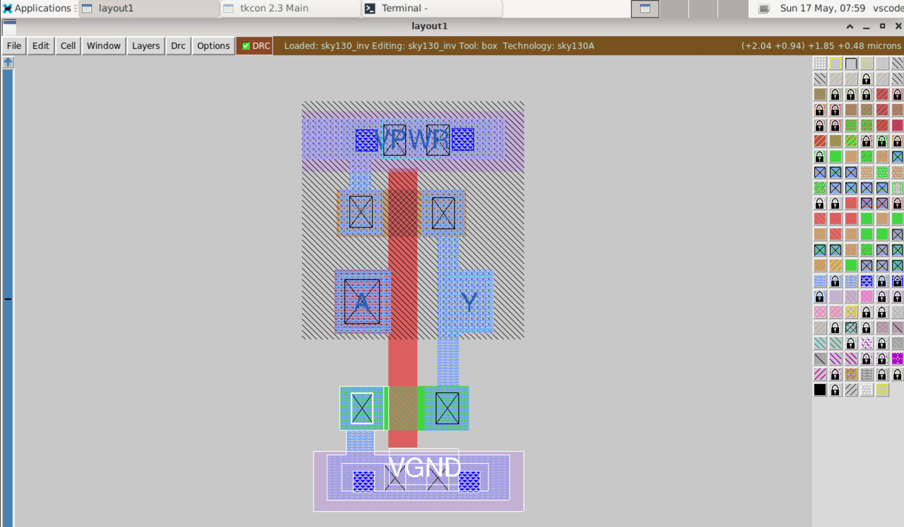

---

## Editing the SPICE File for Simulation

The generated SPICE netlist was modified to include:

- PMOS and NMOS model libraries
- Input pulse definition
- Power supply connections
- Load capacitances
- Transient simulation commands

```spice
.option scale=0.01u
.include ./libs/pshort.lib
.include ./libs/nshort.lib
```

Transient analysis setup:

```spice
.tran 1n 20n
.control
run
.endc
.end
```

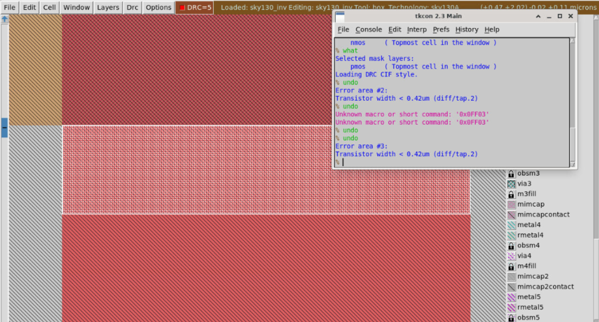

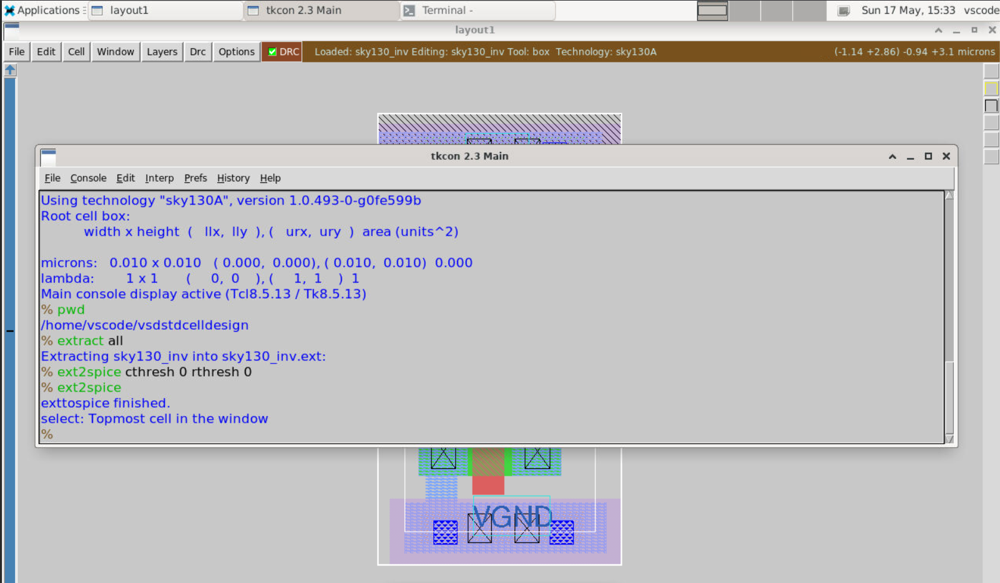

---

## Running ngspice Simulation

The extracted inverter netlist was simulated using ngspice.

```bash
ngspice sky130_inv.spice
```

The transient analysis successfully generated switching data for the inverter.

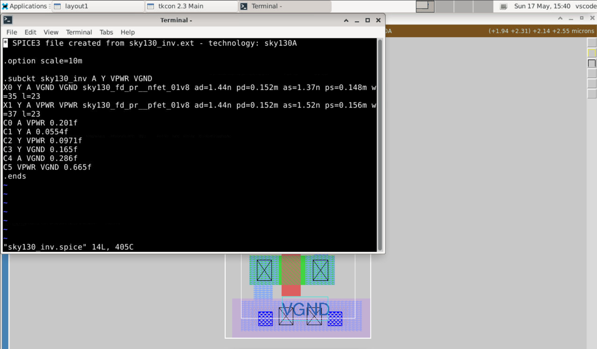

---

## Plotting Input and Output Waveforms

The inverter input and output waveforms were plotted inside ngspice to observe the switching behavior.

```spice
plot y vs time a
```

The waveform verified correct inverter functionality:

- Input HIGH → Output LOW
- Input LOW → Output HIGH

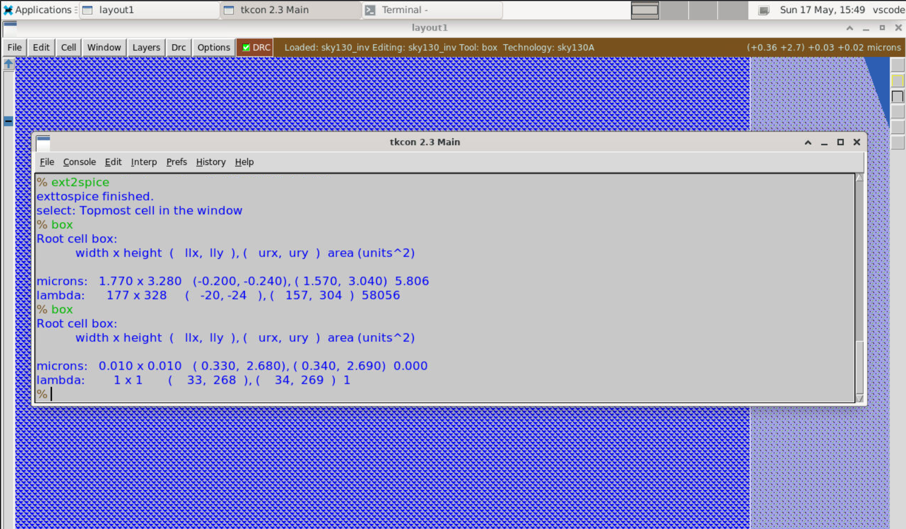

---

## Observing Inverter Characteristics

The transient response helped in analyzing important timing parameters such as:

- Rise time
- Fall time
- Propagation delay
- Switching threshold
- Signal inversion characteristics

The simulation also demonstrated how parasitic capacitances extracted from layout influence circuit behavior.

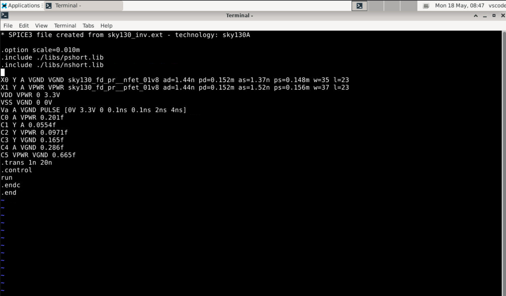

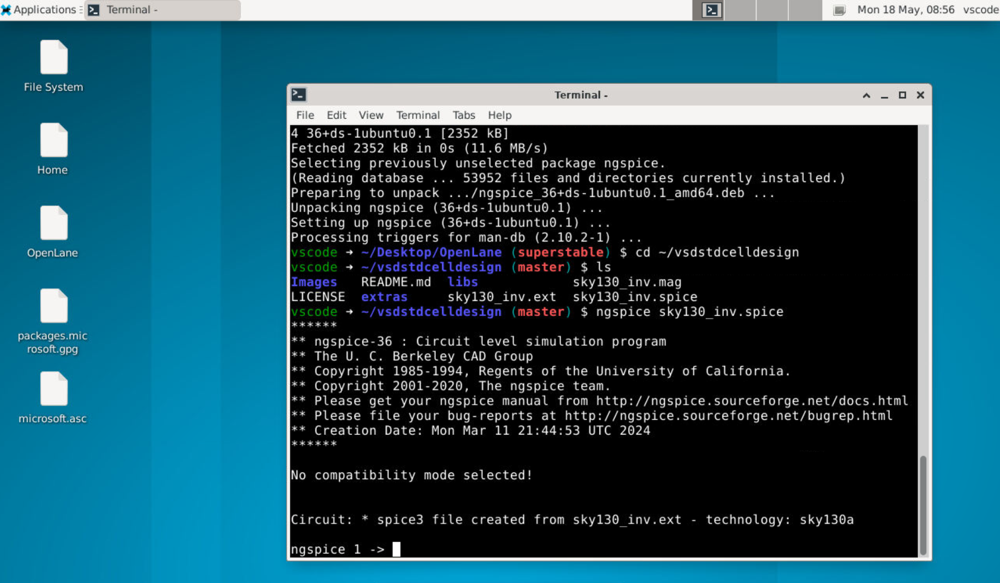

---

## Exploring Layout Connectivity and Layers

Magic VLSI was further used to inspect connectivity between different layers including:

- Poly
- Metal layers
- Contacts
- Wells
- Source and drain regions

This helped in understanding how physical layouts are translated into electrical connectivity.

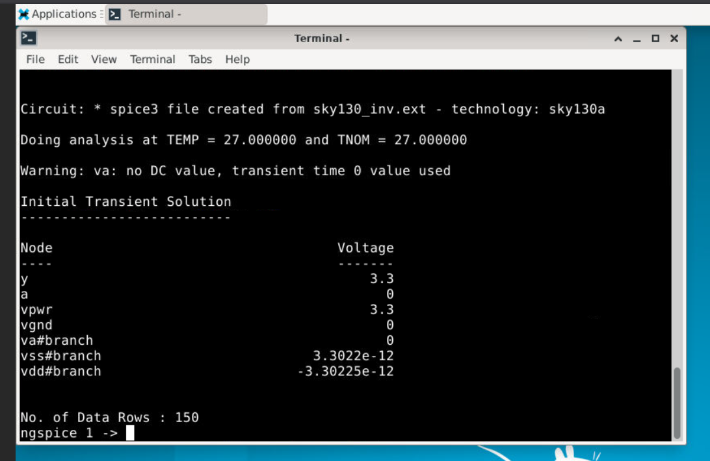

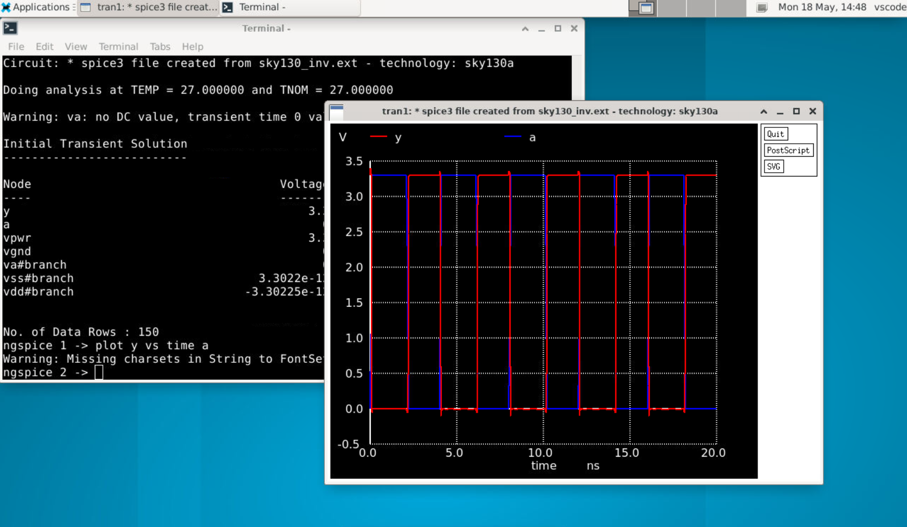

---

## Understanding Post-Layout Parasitics

The extracted SPICE netlist included parasitic capacitances generated from the physical layout.

These parasitics affect:

- Signal transition speed
- Delay
- Dynamic power consumption
- Noise margins

This demonstrated the importance of post-layout characterization in ASIC design.

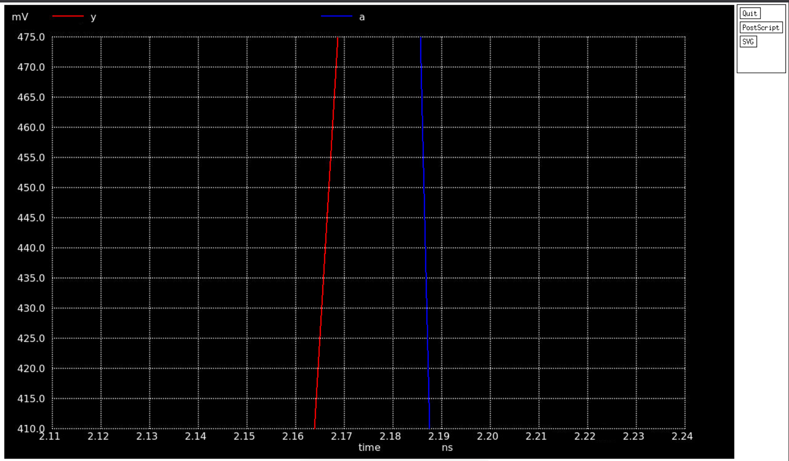

---

## Final Inverter Characterization

After correcting model references and simulation settings, the CMOS inverter simulation was successfully verified using ngspice.

The complete flow from layout visualization to post-layout SPICE characterization was successfully implemented.


---

---

# Sky130 DRC Rule Exploration using Magic VLSI

## Overview

This section focused on understanding Sky130 Design Rule Checks (DRC) using Magic VLSI and exploring how fabrication rules are implemented inside the Sky130 technology file.

The lab demonstrated:

- Downloading Sky130 DRC test cases
- Opening layouts inside Magic
- Running DRC verification
- Identifying rule violations
- Modifying Sky130 technology rules
- Rechecking DRC errors after rule updates

---

## Downloading and Extracting DRC Test Files

The Sky130 DRC test files were downloaded from the Open PDK archive.

```bash
wget http://opencircuitdesign.com/open_pdks/archive/drc_tests.tgz
```

The compressed archive was extracted and the extracted files were verified.

```bash
tar xfz drc_tests.tgz
cd drc_tests/
ls -al
```

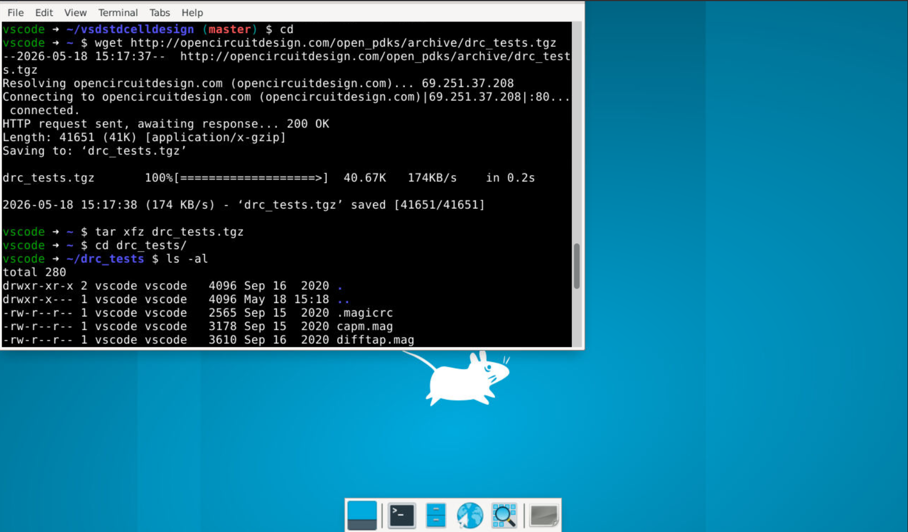

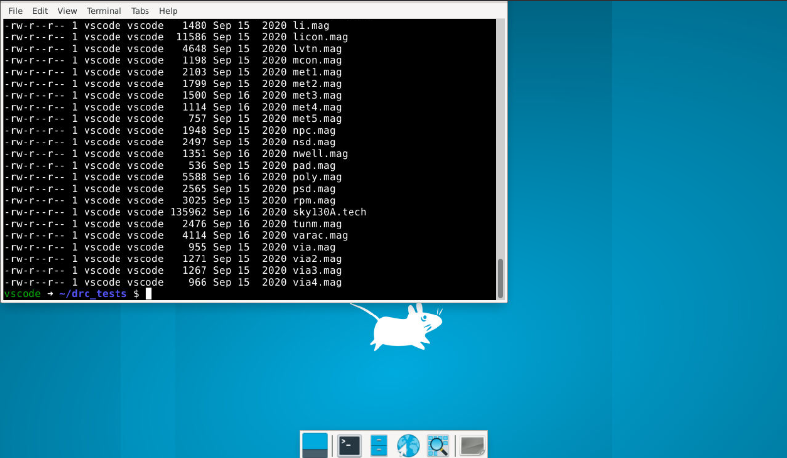

---

## Opening DRC Test Layout in Magic

The Metal3 DRC test layout was opened inside Magic VLSI.

```bash
magic -d XR met3.mag &
```

The layout contained multiple Metal3 structures demonstrating:

- Correctly designed patterns
- Incorrect DRC violating structures
- Unimplemented rule examples

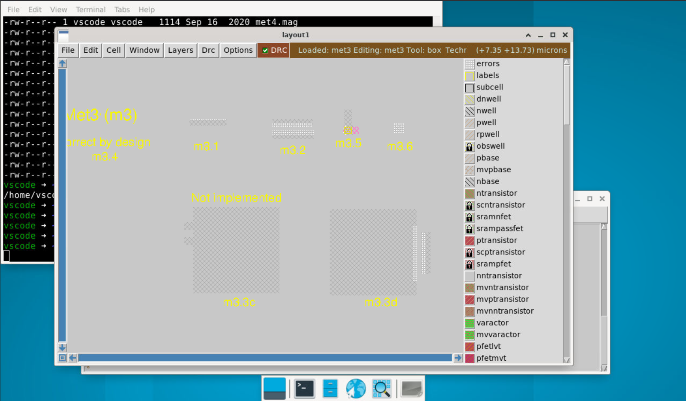

---

## Measuring Layout Geometry using Magic

The `box` command was used inside the Magic console to measure dimensions of selected geometries.

```tcl
box
```

The measured dimensions helped verify layout widths and spacing against Sky130 DRC constraints.

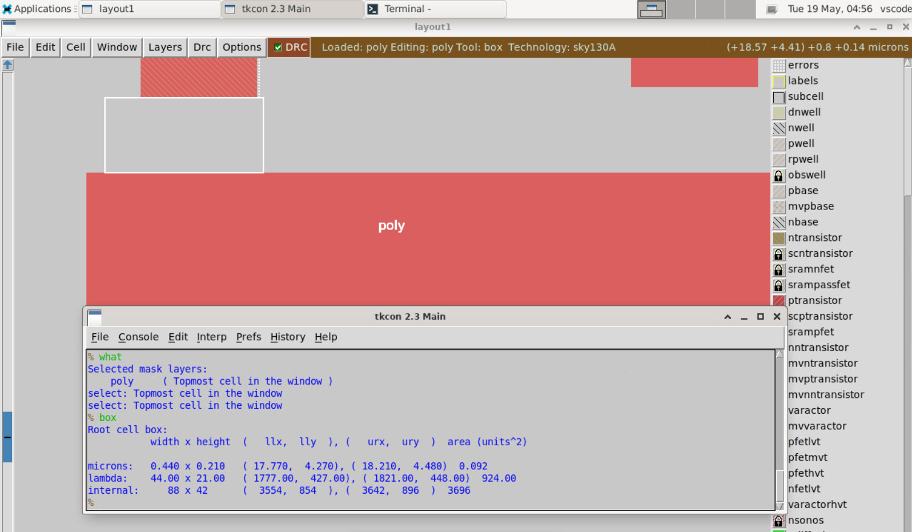

---

## Running DRC Verification

Design Rule Check was performed on the selected layout.

```tcl
drc check
drc why
```

The DRC engine successfully detected rule violations in the layout.

Example violation detected:

- Poly resistor width less than minimum allowed value

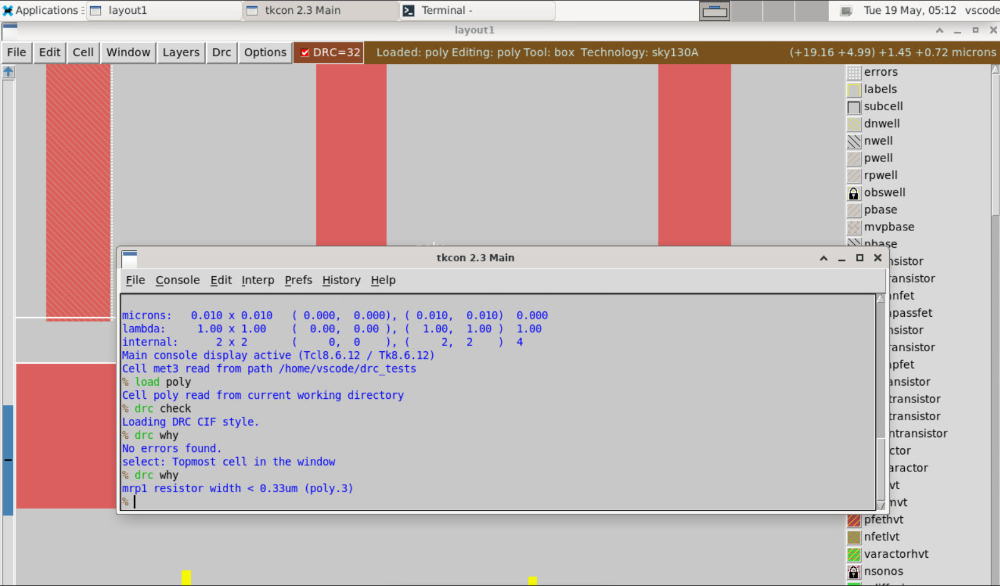

---

## Inspecting Sky130 Technology File Rules

The Sky130 technology file was opened to inspect the implemented DRC rules.

The Poly section inside the technology file defined rules such as:

- Minimum poly width
- Poly spacing
- Poly overlap
- Diffusion spacing constraints

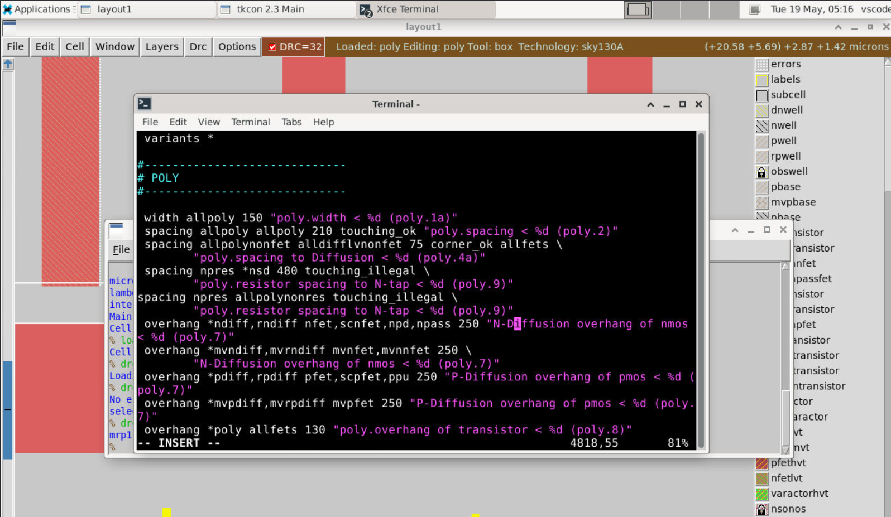

---

## Understanding Poly Resistor Spacing Rules

Additional rules related to high-resistance poly structures were explored.

These included:

- P+ poly resistor spacing
- Diffusion spacing
- Resistor enclosure constraints

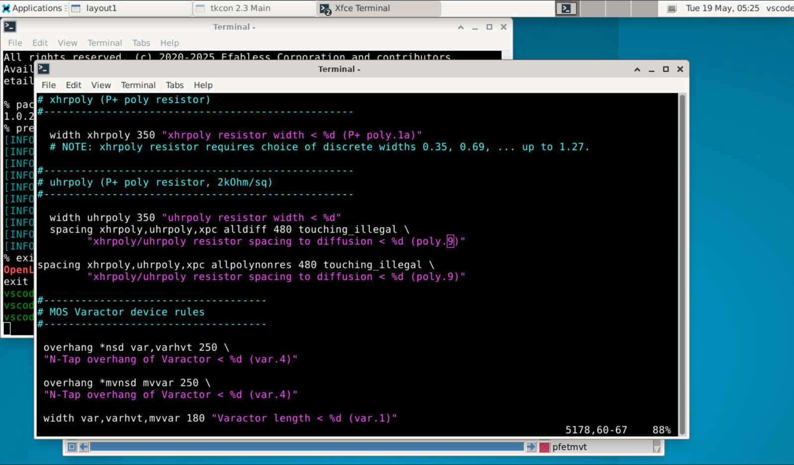

---

## Exploring Deep N-Well and N-Well Rules

The Sky130 technology file was further inspected to study:

- Deep N-Well spacing rules
- N-Well overlap constraints
- SONOS device well requirements
- Well tap placement conditions

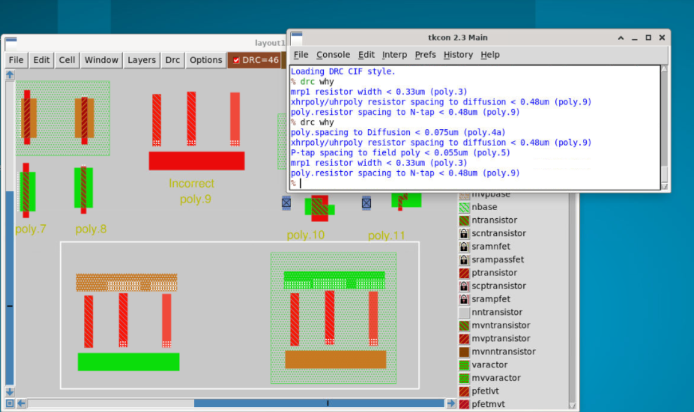

---

## Modifying DRC Rules inside Technology File

The DRC style section inside the Sky130 technology file was edited to understand how rules are implemented internally.

The modifications included:

- Defining custom DRC layers
- Adjusting enclosure checks
- Verifying Deep N-Well overlap conditions

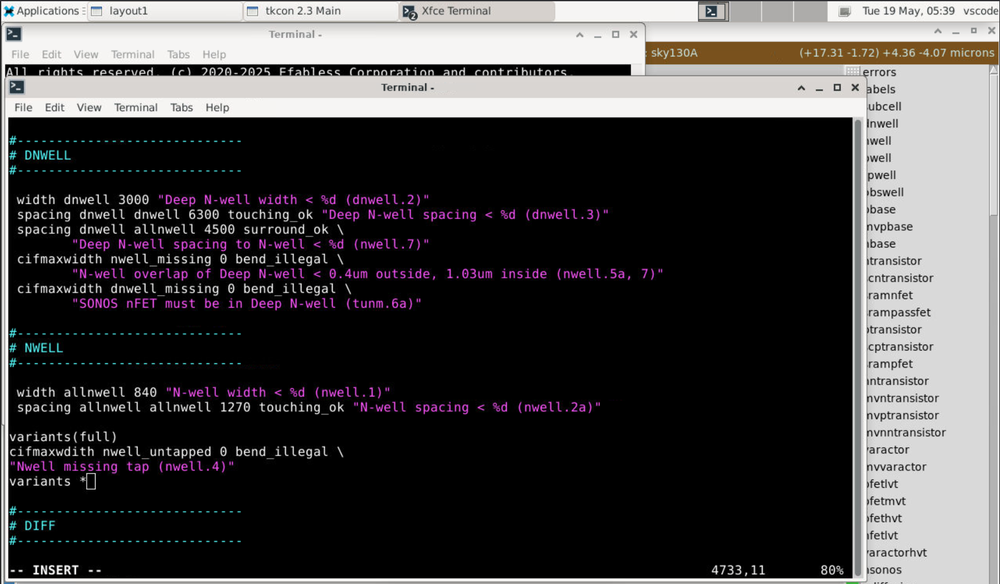

---

## Re-running DRC after Rule Updates

After updating the technology file, DRC verification was rerun inside Magic.

The updated DRC engine successfully reflected the modified rules and identified corresponding layout violations.

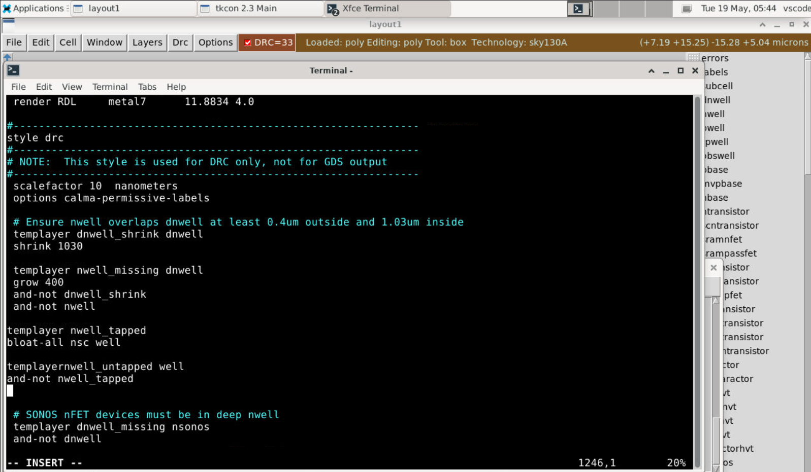

---

## Final Verification of DRC Clean Layout

After correcting the layout geometry and validating the updated rules, the layout passed DRC verification successfully.

```tcl
drc why
```

Output:

```tcl
No errors found.
```

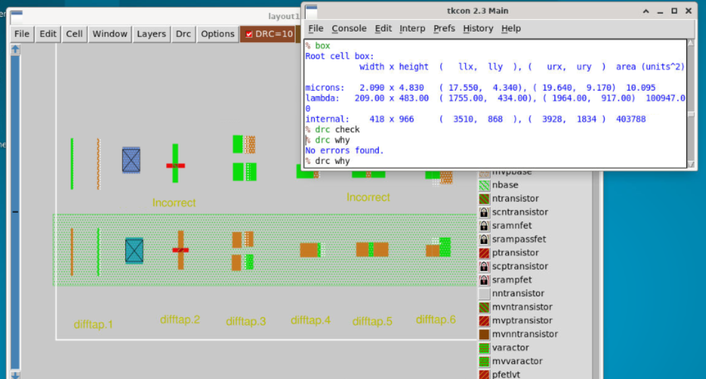

---
## Key Learnings from Day 3

- Understood CMOS inverter design at transistor level
- Learned layout visualization using Magic VLSI
- Performed DRC verification using Magic
- Generated SPICE netlists from physical layouts
- Simulated inverter behavior using ngspice
- Observed post-layout parasitic effects
- Explored Sky130 DRC rule implementation
- Learned how fabrication rules are enforced
- Modified and validated DRC technology rules
- Gained practical exposure to layout verification and characterization

---

# Conclusion

Day 3 provided comprehensive hands-on exposure to custom standard cell design, layout verification and post-layout circuit characterization using open-source VLSI tools.

The lab demonstrated how physical layout directly influences electrical performance, timing behavior and manufacturability in ASIC design.

This session strengthened the understanding of transistor-level layout design, parasitic extraction, DRC verification and technology rule implementation within the Sky130 open-source ASIC flow.

---

