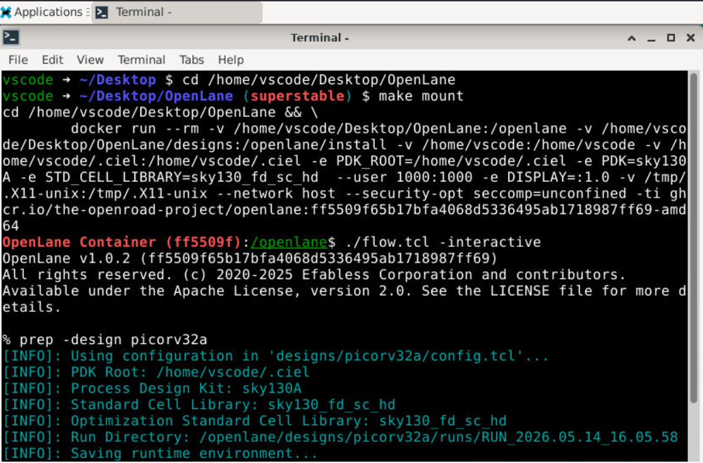
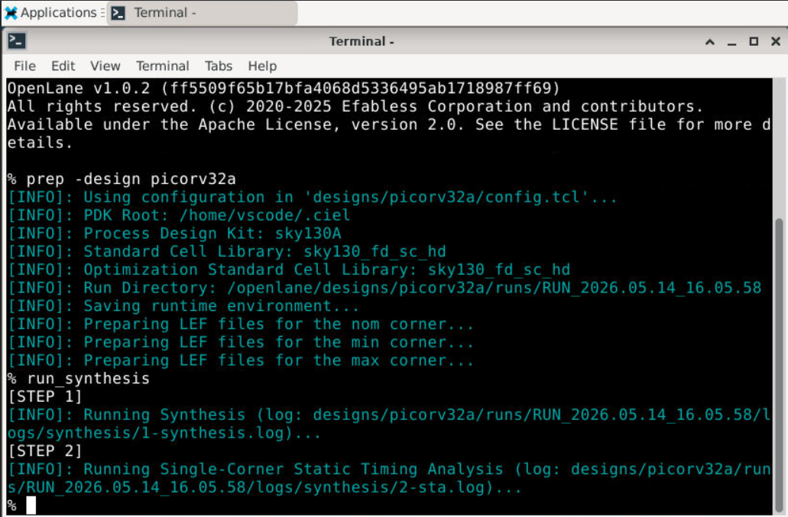
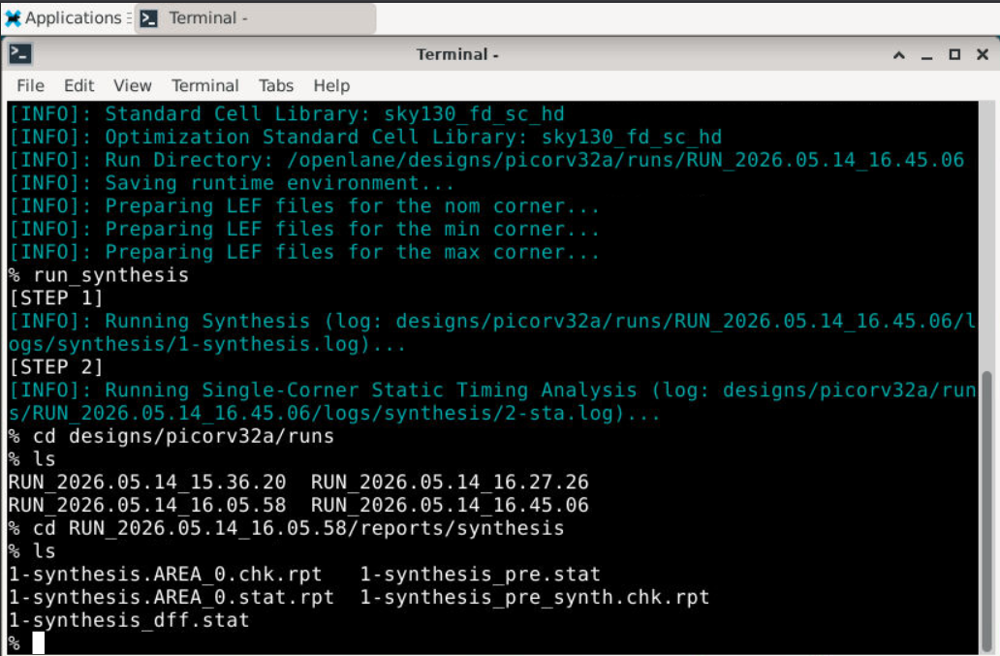
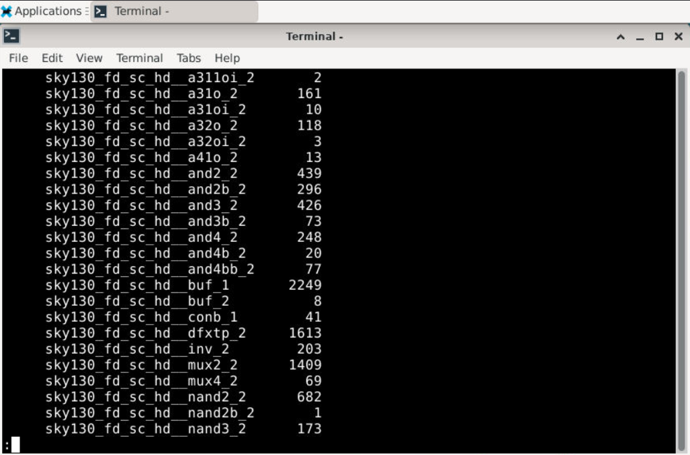
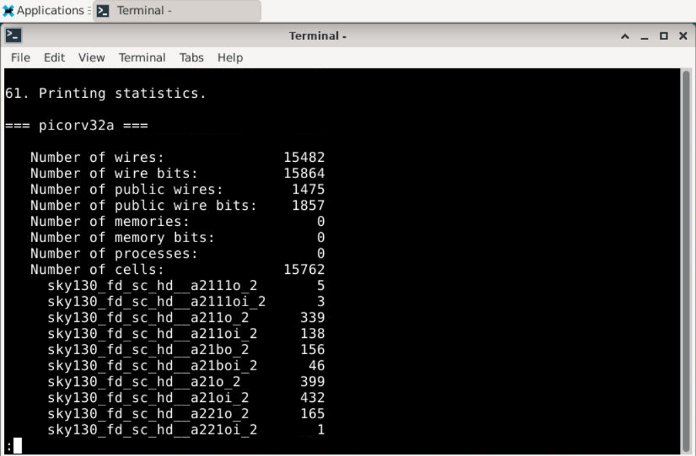

# RTL-to-GDSII-OpenLane-VSD 

## Digital VLSI SoC Design and Planning - RTL to GDSII

A hands-on workshop on complete RTL-to-GDSII flow for digital VLSI SoC design using OpenLane and Sky130 PDK.  
This repository documents my learning, lab progress, implementation results and key observations from each day of the VSD SoC Design and Planning Workshop.

---

# Day 1 — Inception of Open-source EDA, OpenLANE and Sky130 PDK

The first day of the workshop introduced the complete open-source RTL-to-GDSII ASIC design methodology using OpenLane and the Sky130 Process Design Kit (PDK).  
The focus was mainly on understanding the ASIC physical design flow, setting up the OpenLane environment, and performing RTL synthesis on the `picorv32a` RISC-V core.

---

## Day 1 Workflow Overview

| Stage | Description |
|---|---|
| OpenLane Setup | Launching OpenLane inside Docker environment |
| Interactive Mode | Starting Tcl-based OpenLane shell |
| Design Preparation | Loading and configuring `picorv32a` |
| RTL Synthesis | Converting RTL into gate-level netlist |
| Report Analysis | Analyzing synthesis statistics and cell usage |

---

## Launching OpenLane Environment

The OpenLane environment was initialized by entering the OpenLane directory and launching the Docker container in interactive mode.

### Commands Used

```bash
cd /home/vscode/Desktop/OpenLane
make mount
./flow.tcl -interactive
package require openlane 1.0.2
```

The following screenshot shows the successful launch of the OpenLane interactive environment.



---

## Preparing the picorv32a Design

The `prep` command initializes the required environment variables, configuration files, libraries and run directories needed for executing the OpenLane flow.

### Command Used

```tcl
prep -design picorv32a
```

### Important Information Generated During Preparation

| Parameter | Value |
|---|---|
| Process Design Kit | sky130A |
| Standard Cell Library | sky130_fd_sc_hd |
| Optimization Library | sky130_fd_sc_hd |
| Design Name | picorv32a |

The OpenLane environment also creates a dedicated run directory for storing reports, logs, temporary files, and generated outputs.



---

## RTL Synthesis using OpenLane

RTL synthesis converts the Verilog RTL description into a gate-level netlist using standard cells from the Sky130 standard-cell library.

### Command Used

```tcl
run_synthesis
```

During synthesis, OpenLane performs:
- Logic synthesis
- Technology mapping
- Timing optimization
- Static Timing Analysis (STA)

The synthesis logs also indicate different synthesis stages being executed internally.



---

## Exploring Generated Synthesis Reports

After synthesis completion, OpenLane automatically generates multiple synthesis reports containing timing, area, and cell utilization statistics.

### Commands Used

```bash
cd designs/picorv32a/runs/RUN_<timestamp>/reports/synthesis
ls
```

### Generated Report Files

| Report File | Purpose |
|---|---|
| `1-synthesis.AREA_0.stat.rpt` | Area and cell utilization statistics |
| `1-synthesis_pre.stat` | Pre-synthesis statistics |
| `1-synthesis_dff.stat` | Flip-flop statistics |
| `1-synthesis_pre_synth.chk.rpt` | Pre-synthesis checks |



---

## Synthesis Statistics and Cell Utilization

The generated synthesis report provides detailed information regarding:
- Number of wires
- Number of cells
- Standard-cell usage
- Flip-flop count
- Logic gate distribution

### Important Synthesis Statistics

| Parameter | Value |
|---|---|
| Total Cells | 15762 |
| Total Wires | 15482 |
| Public Wires | 1475 |
| Memory Bits | 0 |
| D Flip-Flops (`dfxtp_2`) | 1613 |

The report also shows the usage count of different standard cells such as:
- Buffers
- NAND gates
- Multiplexers
- Inverters
- Flip-flops

This helps in understanding how the RTL design is physically mapped into technology-specific standard cells.



---

## Key Takeaways from Day 1

- Understood the complete RTL-to-GDSII ASIC design flow.
- Learned how OpenLane operates inside a Docker-based environment.
- Explored the Sky130 open-source Process Design Kit.
- Successfully synthesized the `picorv32a` RISC-V core.
- Analyzed synthesis reports and standard-cell statistics.
- Understood how RTL designs are transformed into gate-level netlists.
